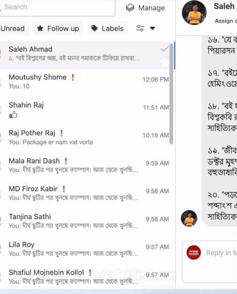

# Facebook Page Marketing BOT
A PyAutoGUI Solution by myself to automate mouse-cursor for Facebook Marketing. This app can send a particular message to each of your page-conversation one by one.
This will help a Facebook page to engage more people by privately messaging them on Facebook Messanger.

## Use Cases
Suppose,
- You have a Facebook page like [Campus Catering](https://www.facebook.com/campus.catering)
- Each day, they sell various kinds of dishes. 
- So they want to send messages to every customer by telling them which food they have that day.
- It is boring to send one by one manually.

So, here comes the solution. 
</br>

## Steps to Follow
- Open a web browser and go to Meta Business Suite App to Manage Pages.
- Place the cursor on the first chat of your messanger from where you want to start sending. 
- Run the detect_cursor( ) method detect your mouse cursor position if the mouse cursor behave inappropiately.

It will return something like [230,160] where (x,y) =(230,160)

```python
def detect_cursor():
    time.sleep(6)
    print("Waiting to setup a position...")
    location = [pyautogui.position().x, pyautogui.position().y]
    print("Mouse position detected at : ", pyautogui.position())
    return location
```
## Demonstration
Finally, the code will work like below. It will select each of the conversation from left panel and send a specific message to customers.
</br>
</br>
Here, I am trying to send a message like this:

```text
Hi there, This is a test message
```
#### N.B:
- Here, I didn't click the send because of demonstration purpose.
- Also, I tried not to show their faces because of their privacy purpose.
- Sending test messages to customers may feel them disturbing and irritating.
- This GIF might look like a manual select and copy-paste operation. But it actually works like this
</br>
</br>
</br>

<center>
    
<h6>Created with ❤️ by Akif Islam</h6>

</center>

